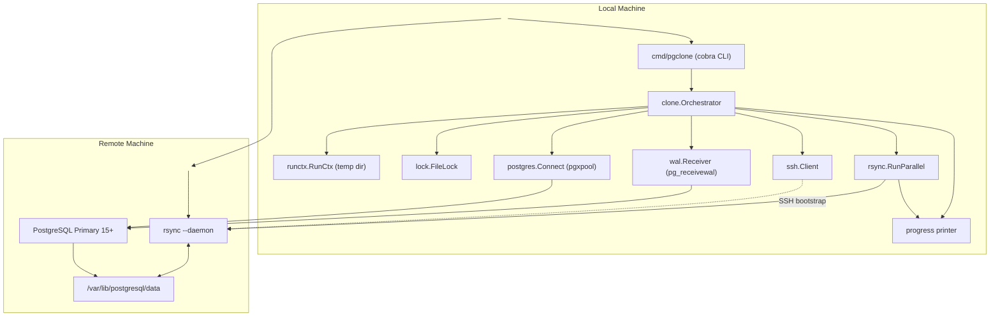

# pgclone Architecture

The diagram shows how the CLI orchestrates components:

1. **File lock** prevents concurrent runs on the same replica data directory.
2. **RunCtx** provides a run-scoped temporary directory automatically cleaned up (unless `--keep-run-tmp`).
3. **wal.Receiver** starts `pg_receivewal` to stream WAL ahead of the file copy.
4. **rsync.RunParallel** boots a transient `rsyncd` on the primary host and spawns parallel workers to copy `base/` and tablespaces.
5. A lightweight `pgx` pool is used for control queries (`pg_backup_start/stop`, waiting for replication, etc.). 